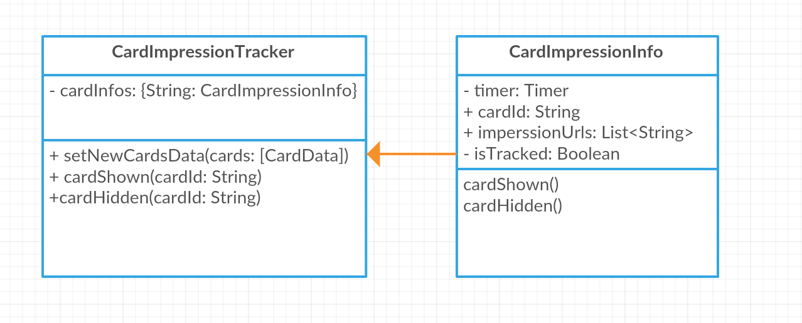

# Zowdow Autosuggest Service

© 2015-2017 Zowdow, Inc.

The Zowdow Autosuggest service is intended to provide application developers with a new opportunity to monetize in the search autosuggest space.

We offer a robust, micro-SDK for Android that is currently deployed across many distribution partners.

We also offer access through a direct API as documented in the example here.

The application developer will require an app-id key in order to integrated and test. You can request an app-id key by sending an email to dev@zowdow.com.

## Version

Current version as of Feb, 7 2017 is 1.0.1.

## Overview

This application demonstrates basic interaction with Zowdow AutoSuggest API.
More detailed info about their usage is described below, after the Architecture section.

## Architecture

The project consists of 3 key packages:

*   **injection** consists of Dagger modules and components. For now, there is a single module
called `NetworkModule` and it provides the access to Retrofit-service classes that represent request calls
to Zowdow API. We use Dagger 2 in order to make this project unit-testable in a closest perspective & also to keep
its' architecture clean. `NetworkComponent` is initialized inside `ZowdowDirectApplication` class.

*   **network** consists of Retrofit-service classes, which purpose was described above & also entity-classes, which
mostly represent suggestions, cards & ad listings.

*   **ui** is for Activity classes, adapters, custom views & interfaces with callback-methods.
There only activity that plays such an important role in application's workflow is `HomeDemoActivity`.
The key events like Zowdow suggestions loading are happening inside this class.
`WebViewActivity` and `VideoActivity` just represent the cards' content in master-detail flow: it may be either web-
and video-content.

*   **tracking** is responsible for tracking the events related to several forms of interactions with the cards: e.g. card clicks
and impressions.

*   **utils** contains constants-interfaces, simple utility-classes for geolocation, runtime permissions checks, connectivity state observations, requests parameters collection & formatting
and other useful stuff.

## Interaction with Zowdow API ##

Unified API is the key Zowdow API to interact with in order to retrieve and process autosuggest data.
In this app's case, it is about search suggestions retrieval by multiple parameters and keywords, defined by developer.

We implemented `UnifiedApiService` which works with Unified API & some tracking events.

**Base URL for this API**

```
https://u.zowdow.com/v1/
```

All API endpoints constants are available in `network/ApiBaseUrls` interface.

**Consuming Zowdow API**

The example of network call to Zowdow API may be found in `HomeDemoActivity` class.

It is important to collect all necessary parameters common for the API calls to Zowdow. The entry point for this 
inside `HomeDemoActivity` is the `retrieveApiParams()` method which refers to another static method 
in `QueryUtils` class called `getQueryMapObservable` which returns the observable of request parameters map.

Please, note that it's essential to include the **user-agent** value to the parameters map.
In our example it is performed in the first line of getQueryMapObservable

```java
sQueryMap.put(USER_AGENT, getUserAgent(context));
```

within `getUserAgent` method call, which basically returns the UA:

```java
private static String getUserAgent(Context context) {
    if (sUserAgent == null || sUserAgent.isEmpty()) {
        sUserAgent = new WebView(context).getSettings().getUserAgentString();
    }
    return sUserAgent;
}
```

Consider calling this method on the UI-thread as it is done in our example!

The method below called `findSuggestions` retrieves suggestions response and converts its contents into
the list full of cards with the parameters we need to render cards in the suggestion carousels (lists).
If the server response is successful we are switching to the UI thread and passing retrieved and processed suggestions
into suggestions list view's adapter.

```
    private void findSuggestions(String searchKeyWord) {
        Map<String, Object> queryMap = QueryUtils.createQueryMapForUnifiedApi(searchKeyWord, currentCardFormat);
        unifiedApiSubscription = unifiedApiService.loadSuggestions(queryMap)
                .subscribeOn(Schedulers.io())
                .cache()
                .subscribe(this::processSuggestionsResponse, throwable -> {
                    Toast.makeText(HomeDemoActivity.this, "Could not load suggestions", Toast.LENGTH_SHORT).show();
                    Log.e(TAG, "Could not load suggestions: " + throwable.getMessage());
                });
    }

    private void processSuggestionsResponse(BaseResponse<UnifiedDTO> suggestionsResponse) {
        final String rId = suggestionsResponse.getMeta().getRid();
        suggestionsSubscription = Observable.just(suggestionsResponse)
                .subscribeOn(Schedulers.io())
                .flatMapIterable(BaseResponse::getRecords) // converts response wrapper into an iterable list of suggestions
                .map(suggestionItem -> // performs suggestion deserialization
                        suggestionItem
                                .getSuggestion()
                                .toSuggestion(rId, DEFAULT_CAROUSEL_TYPE, currentCardFormat)
                )
                .toList()
                .observeOn(AndroidSchedulers.mainThread())
                .subscribe(this::onSuggestionsLoaded, throwable -> {
                    Log.e(TAG, "Could not load suggestions: " + throwable.getMessage());
                });
    }
```

**UI-representation of suggestions**

In the scope of this app we consider `stream` as carousel type. It is a simple list of items
 with horizontal scroll. More carousel types like `mid_stream`, `stack` or `rotary` are available in SDK.

`SuggestionsAdapter` performs the suggestions list rendering. Each suggestion row is bound by
view holder class called `SuggestionViewHolder`, which contains a RecyclerView for cards. `CardsAdapter` instance should be
attached to each of these RecyclerViews in view holder instances.

**Card formats**

You may also dynamically change the cards format by replacing the `card_format` value
for suggestions' retrieval query map.

All card formats are declared in the interface `utils/constants/CardFormats`.

# Tracking

We use `clickUrl` and `impressionUrl` field values for cards interaction tracking. These fields are returned when you pass `tracking=1` in the query parameter call to the API.

The first one for click events, and the another one is for card appearance events. These URLs must be called during a click or an impression event in order for accurate tracking for monetization.

Impression events are processed directly in `CardImageView` class.

**Impressions tracking**

If you are using this example in your production application, you should take measures to correctly track cards impressions. We are using MRC standard for impressions tracking, introducing following rule: impression should be tracked, if at least 50% card is shown for at least 1 second. Also, timer should not invalidate if card persist between 2 consistent requests. We've created a class to simplify tracking work in you application.

Here is class diagram of impressions tracking classes.



You should use `CardImpressionsTracker` class for tracking.

1. When new data is obtained from API, call `setNewCardsData` method and pass new cards to it, collected from all suggestions retrieved for a given keyword.
2. Call `cardShown` method for all cards that are at least 50% visible.
3. Call `cardHidden` method for all other cards as soon as they get less than 50% visible or currently invisible at all.
4. Track all events that can change cards visibility (e.g. view scroll or device orientation change) and call `cardShown` and `cardHidden` methods for cards that changed visibility.

You can follow the approach of cards visibility state observation similar to `trackVisibleCard` method of application's `SuggestionViewHolder` class implementation. In our case this method is invoked every time the new cards data is set and both suggestions and cards lists are scrolled either vertically or horizontally.

`CardImpressionsTracker` will take care about operations such as cards persistence tracking while switching requests and their current visibility state.
Each `CardImpressionInfo` instance contains the information about visibility of the card it represents & its own timer which state is managed by `cardShown` and `cardHidden` methods. Card's impression will be tracked after as soon as this timer expires. Impression tracking is performed by `TrackingRequestManager`'s `trackCardImpression` method.
`TrackingRequestManager` is the interface which declares basic card's tracking actions. They can be customized in any way convenient for the existing project's architecture, inside the class that implements this interface.

## Contact

For technical support please email support@zowdow.com

## Thank You